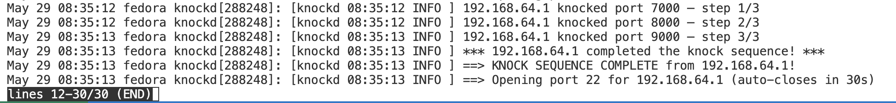

# knockd 

A lightweight security daemon written in C that hides services behind a secret sequence of connection attempts. In its default state, SSH (port 22) is completely firewalled. Only a client that "knocks" on the right ports in the right order gets temporary access, automatically revoked after 30 seconds.

No open ports. No listening sockets. No trace. Just a raw packet sniffer watching in silence.

---

## How It Works

```
Client knocks:   TCP SYN or UDP → 7000 → 8000 → 9000
                                  ↓
Daemon detects:  Raw socket sniffs packets, tracks sequence per IP
                                  ↓
Firewall opens:  iptables -I INPUT -s <YOUR_IP> -p tcp --dport 22 -j ACCEPT
                                  ↓
30 seconds pass: Rule is automatically removed
```

The sniffer uses `AF_PACKET` raw sockets, capturing packets at the network level without binding to any port. This makes the daemon completely invisible to port scanners. Both TCP SYN and UDP knocks are supported.

---

## Requirements

Fedora (or any Linux with raw socket support):

```bash
sudo dnf groupinstall "Development Tools"
sudo dnf install gcc make nmap iptables-nft
```

> The daemon must run as **root** because raw sockets (`AF_PACKET`) and `iptables` both require elevated privileges.

---

## Installation and Configuration

1. Build and install the daemon:
```bash
make
sudo make install
```

2. Edit your configuration file at `/etc/knockd.conf`:
```ini
# Secret sequence of ports (default: 7000, 8000, 9000)
sequence = 7000, 8000, 9000
# Port to unlock after a successful knock (default: 22)
port = 22
# Seconds before access is automatically revoked (default: 30)
timeout = 30
# Max seconds allowed between consecutive knocks (default: 15)
window = 15
# Max concurrent client slots in memory (default: 64)
max_clients = 64
# Log verbosity: 0=ERROR, 1=WARN, 2=INFO, 3=DEBUG (default: 2)
log_level = 2
```
*Note: Any invalid or out-of-range config values are automatically reset to safe defaults with warning logs.*

3. Enable and start the systemd service:
```bash
sudo systemctl enable knockd
sudo systemctl start knockd
```

---

## Running and Knocking

### 1. Set up the firewall

> If you are already connected via SSH, run the first line **before** blocking port 22 or you will disconnect yourself.

```bash
# Keep existing connections alive
sudo iptables -I INPUT -m state --state ESTABLISHED,RELATED -j ACCEPT

# Block SSH by default
sudo iptables -A INPUT -p tcp --dport 22 -j DROP
```

### 2. Send the knock sequence

Use the included client script from your machine:

```bash
# Send the knock sequence
./knock_client.sh <server-ip>

# Custom sequence ports and knock delay
./knock_client.sh <server-ip> -p 7000,8000,9000 -d 0.5

# Knock and automatically SSH in afterwards
./knock_client.sh <server-ip> --ssh

# Knock as a specific SSH user
./knock_client.sh <server-ip> --ssh vinayak

# Use UDP knocks instead of TCP
./knock_client.sh <server-ip> --udp
```

The script will tell you exactly what happened and print the SSH command to run.

You can also knock manually. Use `nc` (netcat) for TCP, not `nmap` (see below for why):

```bash
nc -z -w 1 <server-ip> 7000; sleep 0.5
nc -z -w 1 <server-ip> 8000; sleep 0.5
nc -z -w 1 <server-ip> 9000
```

### 3. SSH in

```bash
ssh user@<server-ip>
# You have 30 seconds before the port closes automatically
```

### 4. View logs

Since `knockd` runs as a systemd service, its logs are stored in the journal:
```bash
# Watch live
sudo journalctl -u knockd -f

# See recent entries
sudo journalctl -u knockd -n 50
```

---

## Why nc, not nmap?

Both `nc` (netcat) and `nmap` can send TCP packets, but they behave very differently:

Because `nmap` never completes the TCP handshake, the OS kernel independently retransmits the unanswered SYN after ~1-3 seconds. That retransmit arrives at knockd as a second knock on the same port, which is out of sequence and resets your progress.

`nc` gets a RST back (port closed), the kernel is satisfied, and no retransmit happens.

You can still keep `nmap` installed. The client script uses it as a fallback for UDP knocking (which requires raw sockets that `nc` cannot send). For TCP, `nc` is always preferred.

---

## Verbose Output (what to expect)



---

## Security Notes

- **No shell injection** -- `iptables` is invoked via `fork()`/`execv()`, never `system()`
- **IP validation** -- all IPs pass through `inet_ntop()` before being used in any command
- **Per-IP rules** -- only the knocking IP is granted access, not the whole network
- **Auto-cleanup** -- `systemctl stop knockd` triggers graceful removal of all added rules
- **Invisible** -- no ports are bound; the daemon cannot be found by a port scan

---

## Troubleshooting

| Symptom | Fix |
|---------|-----|
| `Failed to create raw socket` | Confirm you are root and on Linux (not macOS) |
| Knocks detected but sequence keeps resetting | Use `nc` instead of `nmap` for TCP knocking (see above) |
| Knocks not detected at all | Run `sudo tcpdump -i any port 7000` to verify packets arrive at the machine |
| `iptables` errors | Run `sudo dnf install iptables-nft` and check `iptables -L` |
| Port still blocked after knock | Check `sudo iptables -L INPUT -n` -- the ACCEPT rule should appear at the top |
| SSH refused right after knocking | You are SSHing to the right IP, correct? It should be the server's IP, not your own |
